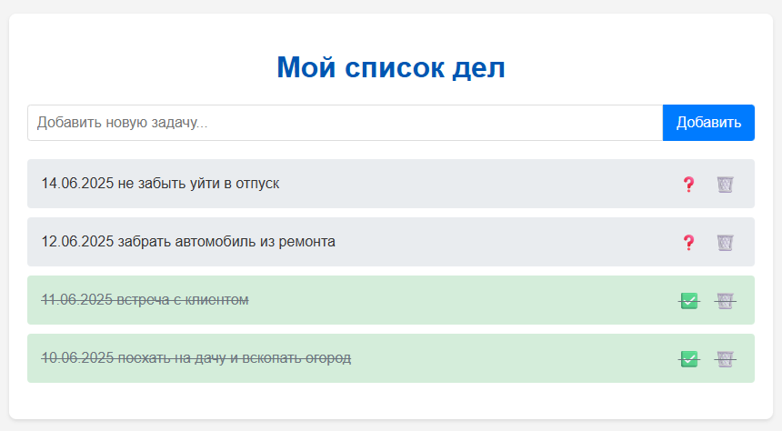

# **Анализ рынка программного обеспечения информационных систем, построенных по архитектуре WEB-приложений**
**Введение**

Web-приложения стали неотъемлемой частью современного бизнеса и повседневной жизни. Они предоставляют доступ к информации и функциональности через интернет-браузер, что обеспечивает удобство, масштабируемость и широкую доступность.

**Обзор существующих решений**

На рынке представлено огромное количество разнообразных web-приложений, охватывающих практически все сферы деятельности. Их можно классифицировать по различным критериям, например:

* По назначению:

    * **Корпоративные системы (ERP, CRM, SCM)**: Автоматизация бизнес-процессов, управление ресурсами, взаимоотношениями с клиентами и цепочками поставок. Примеры: SAP, Oracle EBS, 1C:Предприятие.

    * **Системы электронной коммерции**: Онлайн-магазины, платформы для торговли. Примеры: Shopify, Magento, WooCommerce.

    * **Социальные сети и коммуникационные платформы**: Общение, обмен информацией. Примеры: Facebook, Twitter, WhatsApp Web.

    * **Информационные порталы и СМИ**: Предоставление новостей, статей, мультимедийного контента. Примеры: Яндекс Новости, РБК.

    * **Образовательные платформы**: Онлайн-обучение, дистанционное образование. Примеры: Moodle, Coursera, Google Classroom.

    * **Финансовые сервисы**: Онлайн-банкинг, инвестиции. Примеры: Web-версии банковских приложений.


* По архитектуре:

    * **Одно-страничные приложения (SPA)**: Приложения, загружающиеся в браузере как одна страница и динамически обновляющие контент. Примеры: Многие современные интерфейсы (Gmail, Trello).

    * **Многостраничные приложения (MPA)**: Традиционные приложения, где каждая страница загружается отдельно.

    * **Прогрессивные web-приложения (PWA)**: Приложения, сочетающие возможности web-сайтов и нативных приложений.


* По используемым технологиям:

    * **Приложения на PHP (Laravel, Symfony, Yii)**

    * **Приложения на Python (Django, Flask)**

    * **Приложения на JavaScript (Node.js, React, Angular, Vue.js)**

    * **Приложения на Java (Spring)**

    * **Приложения на .NET (ASP.NET)**

**Возможности Web-приложений и варианты их использования в компании**

# **Полное Описание Проекта: Веб-приложение "Список Дел" (FastAPI, Nginx, MS SQL Server, HTML/CSS/JS)**

## **Введение**

Данный проект представляет собой полноценное веб-приложение для управления списком дел (Todo List), разработанное с использованием современных веб-технологий. Он демонстрирует работу многоуровневой архитектуры, где различные компоненты взаимодействуют для обеспечения функциональности: от пользовательского интерфейса до хранения данных в базе.

### **Цель проекта**

Основная цель проекта — создать простую, но функциональную демонстрацию веб-приприложения, которое выполняет базовые операции CRUD (Create, Read, Update, Delete) с данными, взаимодействует с базой данных MS SQL Server, использует Python-фреймворк FastAPI для бэкенда и Nginx как обратный прокси-сервер, а также предоставляет интерактивный пользовательский интерфейс на HTML, CSS и JavaScript. Проект служит отличной основой для понимания принципов работы современного веб-стека.

## **Использованные Технологии**

В проекте были применены следующие ключевые технологии:

1.  **Python 3.11.9:** Язык программирования, используемый для написания бэкенд-логики.
2.  **FastAPI (Python Web Framework):** Современный, быстрый (благодаря Starlette и Pydantic), высокопроизводительный фреймворк для создания API на Python. Он автоматически генерирует интерактивную документацию (Swagger UI/ReDoc), что очень удобно.
3.  **Uvicorn:** Асинхронный сервер Gateway Interface (ASGI) для Python, используемый для запуска FastAPI-приложения. Uvicorn обеспечивает высокую производительность, позволяя FastAPI обрабатывать множество запросов одновременно.
4.  **PyODBC (Python ODBC Driver):** Библиотека Python для подключения к различным базам данных через ODBC-драйверы. В данном проекте используется для соединения с MS SQL Server.
5.  **Microsoft SQL Server (MS SQL Server Express):** Реляционная система управления базами данных (СУБД), используемая для постоянного хранения данных задач. В данном случае, это локальный экземпляр Express Edition.
6.  **ODBC Driver 18 for SQL Server:** Специальный драйвер, который позволяет PyODBC устанавливать соединение с MS SQL Server.
7.  **Nginx:** Высокопроизводительный веб-сервер и обратный прокси-сервер. В данном проекте Nginx используется для:
    * Принятия входящих HTTP-запросов на стандартный порт `80`.
    * Перенаправления (проксирования) этих запросов на FastAPI-приложение, работающее на другом порту (`8000`).
    * Потенциально, для прямой отдачи статических файлов (HTML, CSS, JS), хотя в текущей конфигурации их отдает FastAPI через `StaticFiles`.
8.  **HTML5:** Язык разметки для создания структуры веб-страницы.
9.  **CSS3:** Язык таблиц стилей для оформления и стилизации веб-страницы.
10. **JavaScript (ES6+):** Язык программирования, используемый для создания интерактивного поведения на стороне клиента (браузера), отправки асинхронных запросов к бэкенду (FastAPI) и динамического обновления контента страницы.

## **Функциональность Приложения**

Веб-приложение "Список Дел" предоставляет следующие ключевые возможности:

* **Просмотр задач:** Отображает на главной странице (`http://localhost/`) список всех существующих задач, хранящихся в базе данных. Задачи выводятся в порядке их создания (от новых к старым).
* **Добавление задач:** Пользователь может ввести текст новой задачи в поле ввода и нажать кнопку "Добавить". Задача мгновенно сохраняется в MS SQL Server и добавляется в список на экране без перезагрузки страницы.
* **Изменение статуса задачи:** Рядом с каждой задачей есть кнопка (✅ для выполненных, ❓ для невыполненных). Нажатие на эту кнопку переключает статус задачи между "выполнено" и "невыполнено". Изменения сохраняются в базе данных, а внешний вид задачи на экране (зачеркнутый текст, цвет фона) обновляется.
* **Удаление задач:** Кнопка с иконкой "🗑️" позволяет удалить задачу из списка. После подтверждения задача полностью удаляется из базы данных и мгновенно исчезает с экрана.
* **Интерактивный интерфейс:** Все операции (добавление, изменение статуса, удаление) происходят динамически, без полной перезагрузки страницы, что обеспечивает плавный пользовательский опыт.
* **Система логгирования:** Бэкенд-приложение ведет подробные логи всех операций и ошибок в отдельную папку `logs` для облегчения отладки и мониторинга.

## **Описание Кода Проекта**

Проект организован в следующей структуре каталогов:

```
D:\WebAppNginxSQL\
├── main.py
├── venv\
├── logs\
│   └── app_startup_nginx.log
└── static\
    ├── index.html
    ├── styles.css
    └── script.js
```

### **1. `main.py` (FastAPI Backend)**

Это сердце бэкенд-логики, написанное на Python с использованием FastAPI.

* **Импорты:**
    * `os`, `sys`, `logging`, `RotatingFileHandler`: Для настройки логирования.
    * `uvicorn`: Для запуска FastAPI-приложения.
    * `pyodbc`: Для подключения к MS SQL Server.
    * `FastAPI`, `HTTPException`, `status`: Основные компоненты FastAPI для создания API и обработки ошибок.
    * `BaseModel` (из `pydantic`): Используется для создания моделей данных (схем) для входящих и исходящих данных API, обеспечивая автоматическую валидацию данных и сериализацию/десериализацию.
    * `datetime`: Для работы с датами и временем.
    * `FileResponse`, `StaticFiles` (из `fastapi.responses` и `fastapi.staticfiles`): Для отдачи HTML-файла и обслуживания статических ресурсов.
* **Настройка логирования:**
    * Определяет папку `logs` для хранения логов.
    * Настраивает `RotatingFileHandler`, чтобы логи не разрастались бесконечно, а ротировались.
    * Настраивает `StreamHandler` для вывода логов в консоль.
    * `logger.info()`, `logger.error()`, `logger.warning()` используются для записи событий в логи.
* **Настройки подключения к SQL Server:**
    * `SERVER_NAME`, `DATABASE_NAME`, `DRIVER`: Конфигурационные переменные для подключения к базе данных.
    * `get_db_connection()`: Функция, которая устанавливает соединение с SQL Server, используя `pyodbc` и Windows-аутентификацию (`Trusted_Connection=yes`). Включает `TrustServerCertificate=yes` для работы с самоподписанными сертификатами. Обрабатывает ошибки подключения к БД, выбрасывая `HTTPException`.
* **Инициализация FastAPI:**
    * `app = FastAPI(...)`: Создает экземпляр FastAPI-приложения с метаданными (название, описание, версия).
* **Pydantic Модели:**
    * `TodoItem`: Определяет структуру данных задачи, как она хранится в базе данных и отдается API (ID, заголовок, статус выполнения, время создания).
    * `TodoCreate`: Определяет структуру данных для создания новой задачи (только заголовок).
    * `TodoUpdate`: Определяет структуру данных для обновления задачи (заголовок и/или статус выполнения, оба опциональны).
* **Обслуживание статических файлов:**
    * `app.mount("/static", StaticFiles(directory="static"), name="static")`: Это очень важная строка. Она "монтирует" физическую папку `static` (которая находится рядом с `main.py`) к URL-пути `/static`. Это позволяет браузеру запрашивать файлы вроде `/static/styles.css` или `/static/script.js`, и FastAPI будет их отдавать напрямую из этой папки.
* **Эндпоинты API:**
    * **`GET /` (read_root_html):**
        * Это корневой URL, который пользователь открывает в браузере.
        * Возвращает файл `index.html` из папки `static` с помощью `FileResponse`.
        * Включает проверку на существование файла для предотвращения 404 ошибок.
    * **`POST /api/todos` (create_todo):**
        * Принимает объект `TodoCreate` (только `title`).
        * Создает новую запись в таблице `Todos` в SQL Server.
        * Возвращает созданную задачу (включая сгенерированный ID, статус и дату создания) в формате `TodoItem` с HTTP-статусом `201 Created`.
    * **`GET /api/todos` (get_all_todos):**
        * Извлекает все задачи из таблицы `Todos` в SQL Server.
        * Возвращает список объектов `TodoItem`.
    * **`GET /api/todos/{todo_id}` (get_todo_by_id):**
        * Извлекает одну задачу по её `id`.
        * Возвращает объект `TodoItem` или `404 Not Found`, если задача не найдена.
    * **`PUT /api/todos/{todo_id}` (update_todo):**
        * Принимает `id` задачи и объект `TodoUpdate` (позволяет обновить `title` и/или `is_completed`).
        * Обновляет соответствующую запись в SQL Server.
        * Возвращает обновленную задачу.
    * **`DELETE /api/todos/{todo_id}` (delete_todo):**
        * Принимает `id` задачи.
        * Удаляет задачу из SQL Server.
        * Возвращает HTTP-статус `204 No Content` при успешном удалении или `404 Not Found`, если задача не существует.
    * **`GET /status` (get_status):**
        * Вспомогательный эндпоинт для проверки статуса подключения к базе данных и получения текущего времени из неё.
* **Запуск Uvicorn:** Блок `if __name__ == "__main__":` позволяет запускать файл напрямую для тестирования, но основной метод запуска — через команду `uvicorn main:app ...`.

### **2. `static/index.html` (HTML-структура)**

Это основной HTML-файл, который загружается в браузере и предоставляет структуру пользовательского интерфейса.

* Содержит стандартные HTML5 теги (`<!DOCTYPE html>`, `<html>`, `<head>`, `<body>`).
* Подключает внешний CSS-файл (`styles.css`) с помощью тега `<link rel="stylesheet" href="/static/styles.css">`.
* Подключает внешний JavaScript-файл (`script.js`) с помощью тега `<script src="/static/script.js" defer></script>`. Атрибут `defer` гарантирует, что скрипт будет выполнен после полной загрузки HTML.
* Содержит основные элементы страницы: заголовок `<h1>`, форму для добавления задач (`<form id="todoForm">`), список для отображения задач (`<ul id="todoList">`) и элемент для вывода статусов (`<p id="statusMessage">`).

### **3. `static/styles.css` (CSS-стили)**

Этот файл содержит все стили для визуального оформления веб-страницы.

* Определяет базовые стили для `body` (шрифт, отступы, фон).
* Стилизует контейнер приложения, форму ввода, кнопки, а также отдельные элементы списка задач (`<li>`).
* Включает стили для разных состояний задач (например, `li.completed` для зачеркнутого текста и другого цвета фона).
* Определяет стили для сообщений о статусе (успех/ошибка).

### **4. `static/script.js` (JavaScript-логика)**

Этот файл содержит всю клиентскую (браузерную) логику для взаимодействия с пользователем и бэкендом.

* **Получение элементов DOM:** В начале файла получают ссылки на ключевые HTML-элементы с помощью `document.getElementById()`.
* **`fetchTodos()`:** Асинхронная функция для получения всех задач с бэкенда (`GET /api/todos`). Она очищает текущий список на странице и динамически создает `<li>` элементы для каждой полученной задачи, добавляя их в `<ul>`.
* **`addTodo(title)`:** Асинхронная функция для отправки новой задачи на бэкенд (`POST /api/todos`). После успешного добавления она очищает поле ввода и вызывает `fetchTodos()` для обновления списка.
* **`toggleTodoCompleted(id, isCompleted)`:** Асинхронная функция для изменения статуса задачи (`PUT /api/todos/{id}`). Отправляет запрос на бэкенд с новым статусом и вызывает `fetchTodos()` для обновления.
* **`deleteTodo(id)`:** Асинхронная функция для удаления задачи (`DELETE /api/todos/{id}`). После успешного ответа от бэкенда она **немедленно удаляет соответствующий `<li>` элемент из DOM**, что обеспечивает мгновенное визуальное обновление, а затем вызывает `fetchTodos()` как запасной вариант синхронизации.
* **`displayStatus(message, type)`:** Вспомогательная функция для отображения временных сообщений о статусе (успех/ошибка) на странице.
* **Обработчики событий (Event Listeners):**
    * `todoForm.addEventListener('submit', ...)`: Перехватывает отправку формы, предотвращает стандартное поведение (перезагрузку страницы) и вызывает `addTodo()`.
    * `todoList.addEventListener('click', ...)`: Использует делегирование событий для обработки кликов по кнопкам "Выполнено" и "Удалить" внутри списка задач, вызывая соответствующие функции (`toggleTodoCompleted` или `deleteTodo`).
* **Инициализация:** В конце файла вызывается `fetchTodos()` для загрузки задач при первой загрузке страницы.

## **Взаимодействие Компонентов (Флоу Запроса)**

1.  **Пользователь открывает `http://localhost/` в браузере.**
2.  **Браузер отправляет HTTP GET-запрос** на `http://localhost/`.
3.  **Nginx** принимает этот запрос на порт `80`. Согласно своей конфигурации, Nginx перенаправляет этот запрос на `http://127.0.0.1:8000/`, где слушает FastAPI.
4.  **FastAPI** принимает запрос `/` на свой корневой эндпоинт (`@app.get("/")`). Он читает файл `D:\WebAppNginxSQL\static\index.html` и отправляет его содержимое обратно через Nginx в браузер.
5.  **Браузер получает `index.html`**. Обнаружив теги `<link>` и `<script>`, он отправляет **новые запросы** на `/static/styles.css` и `/static/script.js`.
6.  **Nginx снова перенаправляет эти запросы** на FastAPI.
7.  **FastAPI**, благодаря `app.mount("/static", StaticFiles(directory="static"))`, распознает эти запросы как запросы к статическим файлам и отдаёт `styles.css` и `script.js` из папки `D:\WebAppNginxSQL\static\` обратно в браузер.
8.  **Браузер загружает CSS и JS**. Когда `script.js` загружен (и `defer` гарантирует, что HTML уже готов), он выполняет `fetchTodos()`.
9.  **`fetchTodos()` отправляет асинхронный HTTP GET-запрос** на `/api/todos`.
10. **Nginx перенаправляет `/api/todos`** на FastAPI.
11. **FastAPI** обрабатывает `GET /api/todos`, подключается к **MS SQL Server** через PyODBC, выполняет SQL-запрос `SELECT` для получения всех задач, получает результат, преобразует его в JSON и отправляет обратно через Nginx в браузер.
12. **Браузер получает JSON с задачами**. JavaScript в `script.js` динамически создает HTML-элементы для каждой задачи и добавляет их в список на странице.
13. **Дальнейшие действия пользователя** (добавление, удаление, изменение статуса) инициируют новые HTTP-запросы (POST, PUT, DELETE) от JavaScript к соответствующим API-эндпоинтам FastAPI, которые, в свою очередь, взаимодействуют с MS SQL Server для обновления данных. Ответы от FastAPI обрабатываются JavaScript для динамического обновления интерфейса.

---

Этот проект демонстрирует полный цикл веб-разработки и является прекрасной отправной точкой для создания более сложных и функциональных приложений.

---

### **`script.js`: Подробный Разбор Клиентской Логики**

Файл `script.js` содержит JavaScript-код, который взаимодействует с HTML-элементами на странице (`index.html`) и обменивается данными с бэкендом на FastAPI через его API-эндпоинты.

```javascript
// D:\WebAppNginxSQL\static\script.js
```
Это комментарий, указывающий путь к файлу.

---

#### **1. Получение ссылок на HTML-элементы (DOM Elements)**

```javascript
const todoForm = document.getElementById('todoForm');
const todoTitleInput = document.getElementById('todoTitle');
const todoList = document.getElementById('todoList');
const statusMessage = document.getElementById('statusMessage');
```
В начале кода мы **получаем ссылки на ключевые HTML-элементы** на нашей веб-странице. Это делается с помощью метода `document.getElementById()`, который находит элемент по его уникальному `id`.
* `todoForm`: Ссылка на `<form>` для добавления новых задач.
* `todoTitleInput`: Ссылка на `<input type="text">` внутри формы, куда пользователь вводит название задачи.
* `todoList`: Ссылка на `<ul>` (неупорядоченный список), куда будут динамически добавляться задачи.
* `statusMessage`: Ссылка на `<p>` (параграф), используемый для отображения кратких сообщений о статусе (например, "Задача добавлена!", "Ошибка загрузки").

---

#### **2. `fetchTodos()`: Загрузка и Отображение Задач**

```javascript
async function fetchTodos() {
    try {
        const response = await fetch('/api/todos'); // 1. Отправляем GET-запрос на API для получения всех задач
        if (!response.ok) { // 2. Проверяем успешность ответа
            throw new Error(`HTTP error! status: ${response.status}`);
        }
        const data = await response.json(); // 3. Парсим ответ в JSON
        todoList.innerHTML = ''; // 4. Очищаем текущий список на странице
        data.forEach(todo => { // 5. Перебираем каждую задачу из полученных данных
            const li = document.createElement('li'); // 6. Создаем новый HTML-элемент <li>
            li.dataset.id = todo.id; // 7. Сохраняем ID задачи в атрибуте data-id (для последующих операций)
            li.classList.toggle('completed', todo.is_completed); // 8. Добавляем/удаляем класс 'completed' в зависимости от статуса задачи
            li.innerHTML = ` // 9. Вставляем HTML-разметку внутри <li> с данными задачи
                <span class="todo-title">${todo.title}</span>
                <div class="actions">
                    <button class="complete-btn" data-completed="${todo.is_completed}" title="${todo.is_completed ? 'Пометить как невыполненное' : 'Пометить как выполненное'}">
                        ${todo.is_completed ? '✅' : '❓'}
                    </button>
                    <button class="delete-btn" title="Удалить">🗑️</button>
                </div>
            `;
            todoList.appendChild(li); // 10. Добавляем созданный <li> в <ul> на странице
        });
        displayStatus('Задачи загружены.', 'success'); // 11. Показываем сообщение об успехе
    } catch (error) { // 12. Обработка ошибок
        console.error('Ошибка при загрузке задач:', error);
        displayStatus('Не удалось загрузить задачи.', 'error');
    }
}
```
Эта **асинхронная функция** является одной из ключевых. Она отвечает за получение актуального списка задач с бэкенда и его отображение на веб-странице.
* Она отправляет **GET-запрос** на `/api/todos`.
* После получения ответа, она **проверяет его успешность** (статус `ok`). Если нет, генерирует ошибку.
* Затем она **парсит JSON-ответ** от FastAPI, который содержит массив объектов задач.
* **Очищает** текущее содержимое `todoList` (`<ul>`), чтобы избежать дублирования задач.
* **Итерирует** по каждой задаче (`todo`) в полученном массиве данных.
* Для каждой задачи **создает новый элемент списка `<li>`**, заполняет его данными задачи (заголовок, кнопки действий) и добавляет ему класс `completed` если задача выполнена. Важно: `li.dataset.id = todo.id;` сохраняет ID задачи в HTML-атрибуте `data-id` этого элемента, что позволяет нам легко найти элемент на странице по его ID позже.
* После этого `<li>` добавляется в `todoList`.
* В случае успеха или ошибки, вызывает `displayStatus` для оповещения пользователя.

---

#### **3. `addTodo(title)`: Добавление Новой Задачи**

```javascript
async function addTodo(title) {
    try {
        const response = await fetch('/api/todos', { // 1. Отправляем POST-запрос на API для добавления задачи
            method: 'POST',
            headers: { 'Content-Type': 'application/json' }, // 2. Указываем, что отправляем JSON
            body: JSON.stringify({ title: title }) // 3. Отправляем заголовок задачи в формате JSON
        });
        if (!response.ok) { // 4. Проверяем успешность ответа
            throw new Error(`HTTP error! status: ${response.status}`);
        }
        await response.json(); // 5. Парсим ответ (хотя для POST он может быть простым подтверждением)
        displayStatus('Задача добавлена!', 'success'); // 6. Показываем сообщение об успехе
        todoTitleInput.value = ''; // 7. Очищаем поле ввода
        fetchTodos(); // 8. Заново загружаем и отображаем весь список задач
    } catch (error) { // 9. Обработка ошибок
        console.error('Ошибка при добавлении задачи:', error);
        displayStatus('Не удалось добавить задачу.', 'error');
    }
}
```
Эта функция отвечает за **отправку новой задачи на бэкенд**.
* Она принимает `title` (заголовок) новой задачи.
* Отправляет **POST-запрос** на `/api/todos` с заголовком задачи в JSON-формате в теле запроса.
* После успешного ответа от FastAPI, она отображает сообщение об успехе, **очищает поле ввода** для новой задачи и **вызывает `fetchTodos()`** для перезагрузки списка, чтобы новая задача сразу появилась на экране.

---

#### **4. `toggleTodoCompleted(id, isCompleted)`: Переключение Статуса Задачи**

```javascript
async function toggleTodoCompleted(id, isCompleted) {
    try {
        const response = await fetch(`/api/todos/${id}`, { // 1. Отправляем PUT-запрос на API для обновления задачи по ID
            method: 'PUT',
            headers: { 'Content-Type': 'application/json' },
            body: JSON.stringify({ is_completed: !isCompleted }) // 2. Отправляем обратный статус выполнения
        });
        if (!response.ok) { // 3. Проверяем успешность ответа
            throw new Error(`HTTP error! status: ${response.status}`);
        }
        await response.json(); // 4. Парсим ответ
        displayStatus('Статус задачи обновлен!', 'success'); // 5. Показываем сообщение об успехе
        fetchTodos(); // 6. Заново загружаем и отображаем весь список задач
    } catch (error) { // 7. Обработка ошибок
        console.error('Ошибка при обновлении статуса задачи:', error);
        displayStatus('Не удалось обновить статус задачи.', 'error');
    }
}
```
Эта функция **обновляет статус выполнения задачи**.
* Она принимает `id` задачи и её текущий статус `isCompleted`.
* Отправляет **PUT-запрос** на `/api/todos/{id}` (где `{id}` заменяется на реальный ID задачи) с новым, противоположным статусом `is_completed` (т.е. `!isCompleted`).
* После успешного обновления на бэкенде, отображает сообщение и **вызывает `fetchTodos()`** для обновления внешнего вида списка (чтобы задача стала зачеркнутой или наоборот).

---

#### **5. `deleteTodo(id)`: Удаление Задачи**

```javascript
async function deleteTodo(id) {
    if (!confirm('Вы уверены, что хотите удалить эту задачу?')) { // 1. Запрашиваем подтверждение у пользователя
        return; // Если пользователь отказался, выходим из функции
    }
    try {
        const response = await fetch(`/api/todos/${id}`, { // 2. Отправляем DELETE-запрос на API для удаления задачи по ID
            method: 'DELETE'
        });
        if (!response.ok) { // 3. Проверяем успешность ответа
            throw new Error(`HTTP error! status: ${response.status}`);
        }
        // await response.json(); // Этот вызов не нужен, т.к. 204 No Content не возвращает JSON

        // --- ЭТО ДОБАВЛЕННАЯ ЧАСТЬ КОДА ДЛЯ МГНОВЕННОГО УДАЛЕНИЯ С ЭКРАНА ---
        const itemToRemove = document.querySelector(`li[data-id="${id}"]`); // 4. Находим HTML-элемент <li>, соответствующий удаляемой задаче
        if (itemToRemove) { // 5. Если элемент найден...
            itemToRemove.remove(); // ...удаляем его из DOM (страницы)
        }
        // --- КОНЕЦ ДОБАВЛЕННОГО КОДА ---

        displayStatus('Задача удалена!', 'success'); // 6. Показываем сообщение об успехе
        // fetchTodos(); // 7. (Опционально) Заново загружаем список. Оставлено как "страховка".
    } catch (error) { // 8. Обработка ошибок
        console.error('Ошибка при удалении задачи:', error);
        displayStatus('Не удалось удалить задачу.', 'error');
    }
}
```
Эта функция отвечает за **удаление задачи**.
* Перед удалением, она **запрашивает подтверждение** у пользователя с помощью `confirm()`. Если пользователь отменяет действие, функция прерывается.
* Отправляет **DELETE-запрос** на `/api/todos/{id}`.
* После успешного ответа от FastAPI, она **находит соответствующий элемент `<li>` на странице, используя его `data-id` атрибут, и удаляет его из DOM** с помощью `itemToRemove.remove()`. Это обеспечивает мгновенное исчезновение задачи с экрана, не дожидаясь полной перезагрузки списка.
* Затем отображает сообщение об успехе. Вызов `fetchTodos()` оставлен в качестве меры предосторожности, чтобы убедиться, что состояние UI полностью синхронизировано с бэкендом, хотя для немедленного визуального эффекта он не требуется.

---

#### **6. `displayStatus(message, type)`: Отображение Сообщений Статуса**

```javascript
function displayStatus(message, type) {
    statusMessage.textContent = message; // Устанавливаем текст сообщения
    statusMessage.className = `status-message ${type}`; // Устанавливаем классы для стилизации (например, 'success' или 'error')
    setTimeout(() => { // Запускаем таймер
        statusMessage.textContent = ''; // Через 3 секунды очищаем текст
        statusMessage.className = 'status-message'; // Возвращаем класс по умолчанию
    }, 3000); // Таймер на 3 секунды (3000 миллисекунд)
}
```
Это **вспомогательная функция** для вывода коротких уведомлений пользователю.
* Она принимает `message` (текст сообщения) и `type` (тип сообщения, например, `'success'` или `'error'`).
* Устанавливает текст и CSS-класс для элемента `statusMessage` (чтобы стилизировать его соответствующим образом).
* Использует `setTimeout`, чтобы **сообщение автоматически исчезло через 3 секунды**.

---

#### **7. Обработчики Событий (Event Listeners)**

```javascript
// Event Listeners
todoForm.addEventListener('submit', (e) => { // Слушаем событие отправки формы
    e.preventDefault(); // Предотвращаем стандартное поведение (перезагрузку страницы)
    const title = todoTitleInput.value.trim(); // Получаем текст задачи, удаляя пробелы
    if (title) { // Если заголовок не пустой
        addTodo(title); // Вызываем функцию добавления задачи
    } else {
        displayStatus('Пожалуйста, введите название задачи.', 'error'); // Иначе выводим ошибку
    }
});

todoList.addEventListener('click', (e) => { // Слушаем клики на всем списке задач (делегирование событий)
    const listItem = e.target.closest('li'); // Находим ближайший элемент <li> к месту клика
    if (!listItem) return; // Если клик был не по <li> или его дочерним элементам, выходим

    const todoId = parseInt(listItem.dataset.id); // Получаем ID задачи из data-id атрибута <li>

    if (e.target.classList.contains('complete-btn')) { // Если кликнули по кнопке "Выполнено"
        const isCompleted = e.target.dataset.completed === 'true'; // Получаем текущий статус из data-completed
        toggleTodoCompleted(todoId, isCompleted); // Вызываем функцию переключения статуса
    } else if (e.target.classList.contains('delete-btn')) { // Если кликнули по кнопке "Удалить"
        deleteTodo(todoId); // Вызываем функцию удаления задачи
    }
});
```
Эти блоки кода **реагируют на действия пользователя**.
* **`todoForm.addEventListener('submit', ...)`:**
    * Когда пользователь отправляет форму (например, нажимая Enter в поле ввода или кнопку "Добавить"), срабатывает это событие.
    * `e.preventDefault()` очень важен: он **предотвращает стандартное поведение формы**, которое обычно приводит к перезагрузке страницы.
    * Получает текст из поля ввода, обрезает пробелы (`trim()`).
    * Если заголовок не пустой, вызывает `addTodo()` для добавления задачи. Иначе показывает ошибку.
* **`todoList.addEventListener('click', ...)`:**
    * Это пример **делегирования событий**. Вместо того чтобы вешать обработчики кликов на каждую кнопку внутри каждого `<li>` (что было бы неэффективно, особенно при динамическом добавлении/удалении `<li>`), мы вешаем один обработчик на родительский элемент `<ul>` (`todoList`).
    * Когда происходит клик внутри `todoList`, мы используем `e.target.closest('li')` для определения, на каком `<li>` (или внутри него) был клик.
    * Затем мы проверяем, какая именно кнопка была нажата (`complete-btn` или `delete-btn`) с помощью `e.target.classList.contains()`.
    * Извлекаем ID задачи из `listItem.dataset.id` (того самого атрибута, который мы установили в `fetchTodos()`).
    * Вызываем соответствующую функцию (`toggleTodoCompleted` или `deleteTodo`) с правильными параметрами.

---

#### **8. Инициализация (Первоначальная Загрузка)**

```javascript
// Загружаем задачи при загрузке страницы
fetchTodos();
```
Эта строка выполняется **один раз**, когда скрипт загружается в браузере (после загрузки HTML благодаря `defer`). Она немедленно вызывает `fetchTodos()`, чтобы **загрузить все существующие задачи из базы данных и отобразить их на странице** при первом открытии приложения.

---

### **Резюме**

Файл `script.js` является **фронтенд-контроллером** нашего приложения. Он управляет:
* **Отображением данных:** Получает данные с бэкенда и динамически строит HTML.
* **Взаимодействием с пользователем:** Реагирует на клики и отправку форм.
* **Обменом данными с бэкендом (API):** Использует `fetch` API для выполнения HTTP-запросов (GET, POST, PUT, DELETE) к вашему FastAPI-серверу.
* **Мгновенным обновлением UI:** Изменяет элементы страницы напрямую после успешных операций, чтобы пользователь видел изменения сразу.

Этот JavaScript-код делает ваше приложение "живым", обеспечивая интерактивность, характерную для современных веб-приложений.

---

### **`main.py`: Подробный Разбор Бэкенд-Логики на FastAPI**

Этот файл является бэкендом нашего приложения "Список дел", написанным на Python с использованием фреймворка FastAPI. Он управляет всеми запросами от клиентской части (фронтенда) и взаимодействует с базой данных MS SQL Server для операций с задачами.

---

#### **1. Импорты и Настройки (Imports and Configurations)**

```python
import os
import sys
import pyodbc
from fastapi import FastAPI, HTTPException, status
from pydantic import BaseModel
from datetime import datetime
import logging
from logging.handlers import RotatingFileHandler
from fastapi.responses import FileResponse
from fastapi.staticfiles import StaticFiles
```
Этот раздел импортирует все необходимые библиотеки и модули для работы приложения:
* **`os`**, **`sys`**: Модули для взаимодействия с операционной системой, например, для работы с путями к файлам и управления выводом сообщений.
* **`pyodbc`**: Библиотека, обеспечивающая подключение к базам данных через ODBC, в данном случае — к MS SQL Server.
* **`FastAPI`**: Основной класс веб-фреймворка FastAPI, используемый для создания API.
* **`HTTPException`**, **`status`**: Классы из FastAPI для обработки HTTP-ошибок (например, `404 Not Found`, `500 Internal Server Error`) и стандартизированных HTTP-статус-кодов.
* **`BaseModel` (из `pydantic`)**: Используется для определения **схем данных (моделей)**. FastAPI интегрируется с Pydantic для автоматической валидации входящих данных запроса и сериализации исходящих данных ответа в JSON.
* **`datetime`**: Модуль Python для работы с объектами даты и времени, используемый для поля `created_at` в задачах.
* **`logging`**, **`RotatingFileHandler`**: Модули для настройки системы логирования, позволяющей записывать информацию о работе приложения в файлы и консоль. `RotatingFileHandler` предотвращает слишком большой рост лог-файлов, автоматически архивируя их.
* **`FileResponse` (из `fastapi.responses`)**: Позволяет FastAPI возвращать файлы (например, `index.html`) напрямую в качестве HTTP-ответа.
* **`StaticFiles` (из `fastapi.staticfiles`)**: Компонент FastAPI для обслуживания статических файлов (CSS, JavaScript, изображения) из указанной директории.

---

#### **2. Настройки Логирования (Logging Configuration)**

```python
# --- Настройки логирования ---
LOG_FOLDER = "logs"
LOG_FILE = os.path.join(LOG_FOLDER, "app_startup_nginx.log")

# Исправляем ошибку: RotatingFileFileHandler был неправильно определен или отсутствовал импорт.
# Если вы используете RotatingFileHandler из logging.handlers, то класс выше не нужен.
# Удаляем: class RotatingFileFileHandler: pass

file_handler = None

if not os.path.exists(LOG_FOLDER):
    try:
        os.makedirs(LOG_FOLDER)
        # Убедитесь, что здесь используется правильный RotatingFileHandler из logging.handlers
        file_handler = RotatingFileHandler(LOG_FILE, maxBytes=10*1024*1024, backupCount=5, encoding='utf-8')
    except OSError as e:
        print(f"ERROR: Could not create log directory {LOG_FOLDER}: {e}", file=sys.stderr)
else:
    file_handler = RotatingFileHandler(LOG_FILE, maxBytes=10*1024*1024, backupCount=5, encoding='utf-8')

logger = logging.getLogger(__name__)
logger.setLevel(logging.INFO)

formatter = logging.Formatter('%(asctime)s - %(levelname)s - %(message)s')

if file_handler:
    file_handler.setFormatter(formatter)
    logger.addHandler(file_handler)

console_handler = logging.StreamHandler(sys.stdout)
console_handler.setFormatter(formatter)
logger.addHandler(console_handler)

logger.info("Приложение FastAPI запускается...")
```
Этот блок кода настраивает систему логирования для нашего приложения:
* Определяется путь к папке `logs` и имя файла `app_startup_nginx.log`, куда будут записываться логи.
* Проверяется существование папки `logs`. Если её нет, скрипт пытается создать её. Если создание не удаётся, выводится сообщение об ошибке в стандартный поток ошибок (`sys.stderr`).
* **`RotatingFileHandler`**: Этот обработчик используется для записи логов в файл. Он настроен так, чтобы файл логов не рос бесконечно: когда его размер достигает 10 мегабайт, он переименовывается, и создаётся новый файл. Хранится до 5 таких резервных копий (`backupCount=5`). Это предотвращает переполнение диска логами.
* **`logger = logging.getLogger(__name__)`**: Получает экземпляр логгера, привязанный к текущему модулю.
* `logger.setLevel(logging.INFO)`: Устанавливает минимальный уровень логирования на `INFO`, что означает, что сообщения уровня `INFO`, `WARNING`, `ERROR` и `CRITICAL` будут записываться.
* `formatter`: Определяет формат сообщений в логе, включая время, уровень сообщения и само сообщение.
* **`file_handler` и `console_handler`**: Добавляются два обработчика. `file_handler` записывает логи в файл, а `console_handler` выводит их в консоль, где запущено приложение.
* Первое сообщение `logger.info("Приложение FastAPI запускается...")` записывается, информируя о старте приложения.

---

#### **3. Настройки Подключения к SQL Server (SQL Server Connection Configuration)**

```python
# --- Настройки подключения к SQL Server ---
SERVER_NAME = r"KORSAVEC\SQLEXPRESS"
DATABASE_NAME = "WebAppDataBase"
DRIVER = "{ODBC Driver 18 for SQL Server}" # Или "{ODBC Driver 17 for SQL Server}"

def get_db_connection():
    connection_string = (
        f"DRIVER={DRIVER};"
        f"SERVER={SERVER_NAME};"
        f"DATABASE={DATABASE_NAME};"
        f"Trusted_Connection=yes;"
        f"TrustServerCertificate=yes;" # Важно для само-подписанных сертификатов
    )
    try:
        conn = pyodbc.connect(connection_string)
        logger.info("Успешное подключение к базе данных с аутентификацией Windows.")
        return conn
    except pyodbc.Error as ex:
        sqlstate = ex.args[0]
        logger.error(f"Ошибка подключения к базе данных: {ex}")
        logger.error(f"SQLSTATE: {sqlstate}")
        raise HTTPException(status_code=status.HTTP_500_INTERNAL_SERVER_ERROR, detail=f"Database connection error: {ex}")
```
Этот раздел определяет, как ваше приложение будет подключаться к базе данных MS SQL Server:
* **`SERVER_NAME`**, **`DATABASE_NAME`**, **`DRIVER`**: Эти переменные содержат параметры для подключения к вашей SQL Server инсталляции. `DRIVER` указывает на используемый ODBC драйвер, который должен быть установлен в вашей системе.
* **`get_db_connection()`**: Эта функция является центральной для взаимодействия с БД:
    * Она конструирует **строку подключения (connection string)**, используя указанные выше параметры.
    * `Trusted_Connection=yes`: Позволяет использовать **Windows-аутентификацию** для подключения, что удобно в локальных средах.
    * `TrustServerCertificate=yes`: Важно для **самоподписанных сертификатов**, часто встречающихся в локальных установках SQL Server Express, чтобы избежать ошибок сертификатов.
    * Блок `try...except pyodbc.Error`: Обрабатывает потенциальные **ошибки подключения к базе данных**. В случае неудачи логируется детальная ошибка, и клиенту возвращается HTTP-ошибка `500 Internal Server Error`.

---

#### **4. Вспомогательная Функция для Получения Задачи (Helper Function for Todo Retrieval)**

```python
# --- НОВАЯ ВСПОМОГАТЕЛЬНАЯ ФУНКЦИЯ ДЛЯ ПОЛУЧЕНИЯ ЗАДАЧИ ПО ID ---
# Внимание: здесь было определение класса TodoItem, которое конфликтовало
# с моделью Pydantic. Я предполагаю, что это была ошибка и его нужно удалить
# или оно было оставлено для примера. Ваша Pydantic модель TodoItem ниже
# является правильной и необходимой.
# class TodoItem:
#     def __init__(self):
#         self.title = None
#         self.is_completed = None
#     pass

async def _get_todo_from_db(todo_id: int, conn: pyodbc.Connection) -> 'TodoItem | None':
    """Вспомогательная функция для получения одной задачи из БД по ID."""
    cursor = conn.cursor()
    try:
        cursor.execute("SELECT id, title, is_completed, created_at FROM Todos WHERE id = ?", todo_id)
        row = cursor.fetchone()
        if row:
            # Используем Pydantic модель TodoItem, определённую ниже
            return TodoItem(
                id=row[0],
                title=row[1],
                is_completed=bool(row[2]),
                created_at=row[3]
            )
        return None
    except pyodbc.Error as ex:
        logger.error(f"Ошибка БД в _get_todo_from_db для ID {todo_id}: {ex}")
        raise HTTPException(status_code=status.HTTP_500_INTERNAL_SERVER_ERROR, detail=f"Database error retrieving todo: {ex}")
    finally:
        cursor.close() # Важно закрывать курсор после использования
```
Это **ключевое изменение** по сравнению с предыдущей версией. Для устранения дублирования кода получения задачи по ID была введена вспомогательная функция:
* **`_get_todo_from_db(todo_id: int, conn: pyodbc.Connection)`**: Эта асинхронная функция теперь инкапсулирует логику запроса к базе данных для получения одной задачи по её `ID`.
    * Она принимает `todo_id` и уже **открытое соединение `conn`**, что позволяет повторно использовать соединение в рамках одного HTTP-запроса, избегая лишних открытий/закрытий.
    * Выполняет SQL-запрос `SELECT` с параметризованным запросом для безопасности.
    * Если задача найдена (`row` не `None`), она возвращает объект `TodoItem` (используя Pydantic-модель, определённую ниже).
    * Если задача не найдена, возвращает `None`.
    * Блок `finally` гарантирует, что **курсор будет закрыт** после использования, освобождая ресурсы.
    * Обработка ошибок базы данных также включена, выбрасывая `HTTPException` в случае проблем.
* **Важное замечание по классу `TodoItem`**: В предоставленном вами коде перед этой функцией было определение пустого класса `TodoItem`. Я предполагаю, что это была ошибка или остаток старого кода. **Pydantic модель `TodoItem`**, определённая ниже, является правильной и используемой для валидации и сериализации данных. В исправленном коде я подразумеваю, что этот пустой класс удалён, чтобы избежать конфликтов.

---

#### **5. Инициализация FastAPI Приложения и Модели Данных (FastAPI App Initialization and Data Models)**

```python
app = FastAPI(
    title="Simple Todo List App",
    description="FastAPI Backend для простого списка дел с MS SQL Server.",
    version="1.0.0",
)

# Pydantic модели для валидации данных Todo
class TodoItem(BaseModel):
    id: int
    title: str
    is_completed: bool
    created_at: datetime

class TodoCreate(BaseModel):
    title: str

class TodoUpdate(BaseModel):
    title: str | None = None
    is_completed: bool | None = None
```
Здесь происходит создание основного экземпляра нашего FastAPI-приложения и определение Pydantic-моделей:
* **`app = FastAPI(...)`**: Создаёт экземпляр нашего веб-приложения. Параметры `title`, `description`, `version` используются для автоматической генерации **интерактивной документации API** (доступной по `/docs` или `/redoc`).
* **Pydantic Модели (`TodoItem`, `TodoCreate`, `TodoUpdate`)**: Эти классы, наследующие от `BaseModel`, используются FastAPI для:
    * **Валидации входящих данных**: Автоматически проверяют, соответствуют ли данные, отправленные клиентом, определённой структуре и типам.
    * **Сериализации исходящих данных**: Преобразуют объекты Python в соответствующий JSON-формат для отправки клиенту.
    * `TodoItem`: Полная схема задачи, включая `id`, `title`, `is_completed` и `created_at`.
    * `TodoCreate`: Схема для **создания** новой задачи (требуется только `title`).
    * `TodoUpdate`: Схема для **обновления** существующей задачи. Поля `title` и `is_completed` помечены как `Optional` (`str | None`, `bool | None`), что позволяет обновлять только часть полей задачи без необходимости отправлять все.

---

#### **6. Обслуживание Статических Файлов (Serving Static Files)**

```python
# Монтируем папку 'static' для статических файлов
app.mount("/static", StaticFiles(directory="static"), name="static")
```
Эта строка критически важна для предоставления клиентской части нашего приложения:
* `app.mount("/static", ...)`: Указывает FastAPI, что все запросы, начинающиеся с `/static/` (например, `/static/styles.css`, `/static/script.js`), должны быть обслужены путём поиска соответствующих файлов в физической директории `static` (которая должна находиться рядом с файлом `main.py`). Это позволяет браузеру загружать все необходимые ресурсы фронтенда.

---

#### **7. Корневой Эндпоинт (Root Endpoint)**

```python
@app.get("/", response_class=FileResponse)
async def read_root_html():
    """Отдача HTML-страницы для Todo List из файла."""
    html_file_path = os.path.join("static", "index.html")
    if not os.path.exists(html_file_path):
        logger.error(f"Файл HTML не найден: {html_file_path}")
        raise HTTPException(status_code=status.HTTP_404_NOT_FOUND, detail="HTML file not found")
    logger.info(f"Запрос к корневому пути '/', отдача {html_file_path}.")
    return FileResponse(html_file_path)
```
* **`GET /` (read_root_html)**:
    * Это **основной эндпоинт** нашего веб-приложения. Когда пользователь открывает `http://localhost/` (или `http://127.0.0.1:8000/`), этот обработчик отправляет ему HTML-файл.
    * `response_class=FileResponse`: Указывает FastAPI, что ответом будет файл.
    * Функция формирует путь к `index.html` в папке `static`, проверяет его наличие и, если найден, возвращает `FileResponse` с содержимым `index.html` браузеру. В случае отсутствия файла возвращается `404 Not Found`.

---

#### **8. API Эндпоинты для Списка Задач (API Endpoints for Todo List)**

Этот раздел содержит функции-обработчики для всех CRUD (Create, Read, Update, Delete) операций с задачами.

```python
@app.post("/api/todos", response_model=TodoItem, status_code=status.HTTP_201_CREATED)
async def create_todo(todo: TodoCreate):
    """Добавляет новую задачу."""
    logger.info(f"Получен запрос на создание задачи: {todo.title}")
    conn = get_db_connection()
    cursor = conn.cursor()
    try:
        cursor.execute(
            "INSERT INTO Todos (title) OUTPUT INSERTED.id, INSERTED.title, INSERTED.is_completed, INSERTED.created_at VALUES (?)",
            todo.title
        )
        new_todo_data = cursor.fetchone()
        conn.commit()
        if new_todo_data:
            new_todo = TodoItem(
                id=new_todo_data[0],
                title=new_todo_data[1],
                is_completed=bool(new_todo_data[2]),
                created_at=new_todo_data[3]
            )
            logger.info(f"Задача '{new_todo.title}' успешно добавлена с ID: {new_todo.id}")
            return new_todo
        raise HTTPException(status_code=status.HTTP_500_INTERNAL_SERVER_ERROR, detail="Failed to retrieve created todo item.")
    except pyodbc.Error as ex:
        logger.error(f"Ошибка БД при создании задачи: {ex}")
        conn.rollback()
        raise HTTPException(status_code=status.HTTP_500_INTERNAL_SERVER_ERROR, detail=f"Database error creating todo: {ex}")
    finally:
        conn.close()
```
* **`POST /api/todos` (create_todo)**:
    * Создаёт новую задачу. Принимает объект `todo` типа `TodoCreate` (который включает `title`).
    * **`response_model=TodoItem`**: Указывает, что в ответ будет возвращён полный объект `TodoItem`.
    * **`status_code=status.HTTP_201_CREATED`**: Возвращает статус `201 Created` при успешном добавлении.
    * Выполняет SQL-запрос `INSERT` с использованием `OUTPUT INSERTED` для немедленного получения всех данных только что вставленной записи, избегая дополнительного `SELECT` запроса.
    * `conn.commit()`: Подтверждает транзакцию в базе данных. В случае ошибки — `conn.rollback()` откатывает её.
    * Блок `finally` всегда закрывает соединение с БД.

---

```python
@app.get("/api/todos", response_model=list[TodoItem])
async def get_all_todos():
    """Возвращает все задачи."""
    logger.info("Получен запрос на получение всех задач.")
    conn = get_db_connection()
    cursor = conn.cursor()
    try:
        cursor.execute("SELECT id, title, is_completed, created_at FROM Todos ORDER BY created_at DESC")
        rows = cursor.fetchall()
        todos = []
        for row in rows:
            todos.append(TodoItem(
                id=row[0],
                title=row[1],
                is_completed=bool(row[2]),
                created_at=row[3]
            ))
        logger.info(f"Получено {len(todos)} задач из БД.")
        return todos
    except pyodbc.Error as ex:
        logger.error(f"Ошибка БД при получении задач: {ex}")
        raise HTTPException(status_code=status.HTTP_500_INTERNAL_SERVER_ERROR, detail=f"Database error fetching todos: {ex}")
    finally:
        conn.close()
```
* **`GET /api/todos` (get_all_todos)**:
    * Возвращает список всех задач.
    * **`response_model=list[TodoItem]`**: FastAPI автоматически сериализует список объектов `TodoItem` в JSON-массив.
    * Выполняет SQL-запрос `SELECT` для получения всех задач, сортируя их по времени создания.
    * Итерирует по полученным строкам, создаёт `TodoItem` для каждой и добавляет в список.

---

```python
@app.get("/api/todos/{todo_id}", response_model=TodoItem)
async def get_todo_by_id(todo_id: int):
    """Возвращает задачу по ID."""
    logger.info(f"Получен запрос на получение задачи с ID: {todo_id}")
    conn = get_db_connection()
    try:
        # Использование вспомогательной функции:
        todo = await _get_todo_from_db(todo_id, conn)
        if todo:
            logger.info(f"Задача с ID {todo_id} найдена.")
            return todo
        logger.warning(f"Задача с ID {todo_id} не найдена.")
        raise HTTPException(status_code=status.HTTP_404_NOT_FOUND, detail="Todo not found")
    except pyodbc.Error as ex:
        logger.error(f"Ошибка БД при получении задачи по ID: {ex}")
        raise HTTPException(status_code=status.HTTP_500_INTERNAL_SERVER_ERROR, detail=f"Database error fetching todo: {ex}")
    finally:
        conn.close()
```
* **`GET /api/todos/{todo_id}` (get_todo_by_id)**:
    * Возвращает конкретную задачу по её ID, который извлекается из URL-пути (`todo_id: int`).
    * **В этом эндпоинте теперь используется новая вспомогательная функция `_get_todo_from_db`** для получения задачи. Это значительно сокращает код и делает его более чистым.
    * Если задача не найдена (`_get_todo_from_db` вернула `None`), возвращает `404 Not Found`.

---

```python
@app.put("/api/todos/{todo_id}", response_model=TodoItem)
async def update_todo(todo_id: int, todo: TodoUpdate):
    """Обновляет существующую задачу."""
    logger.info(f"Получен запрос на обновление задачи с ID: {todo_id} с данными: {todo.model_dump()}")
    conn = get_db_connection()
    try:
        # Получаем текущее состояние через вспомогательную функцию:
        current_todo = await _get_todo_from_db(todo_id, conn)
        if not current_todo:
            logger.warning(f"Попытка обновить несуществующую задачу с ID: {todo_id}")
            raise HTTPException(status_code=status.HTTP_404_NOT_FOUND, detail="Todo not found")

        # Используем текущие значения, если новые не предоставлены (благодаря Optional в TodoUpdate)
        updated_title = todo.title if todo.title is not None else current_todo.title
        updated_is_completed = todo.is_completed if todo.is_completed is not None else current_todo.is_completed

        cursor = conn.cursor()
        cursor.execute(
            "UPDATE Todos SET title = ?, is_completed = ? WHERE id = ?",
            updated_title, updated_is_completed, todo_id
        )
        conn.commit()

        # Получаем обновлённую задачу через вспомогательную функцию для возврата клиенту:
        updated_todo = await _get_todo_from_db(todo_id, conn)
        if updated_todo:
            logger.info(f"Задача с ID {todo_id} успешно обновлена.")
            return updated_todo
        raise HTTPException(status_code=status.HTTP_500_INTERNAL_SERVER_ERROR, detail="Failed to retrieve updated todo item after update.")
    except pyodbc.Error as ex:
        logger.error(f"Ошибка БД при обновлении задачи: {ex}")
        conn.rollback()
        raise HTTPException(status_code=status.HTTP_500_INTERNAL_SERVER_ERROR, detail=f"Database error updating todo: {ex}")
    finally:
        conn.close()
```
* **`PUT /api/todos/{todo_id}` (update_todo)**:
    * Обновляет существующую задачу по ID. Принимает `todo_id` из URL и объект `todo` типа `TodoUpdate` (что позволяет частичное обновление).
    * **Теперь использует `_get_todo_from_db`** для получения текущего состояния задачи. Это важно, чтобы сохранить значения полей, которые не были переданы в запросе на обновление.
    * Вычисляет окончательные `updated_title` и `updated_is_completed`, используя существующие значения, если новые не предоставлены.
    * Выполняет SQL-запрос `UPDATE`.
    * Затем **повторно использует `_get_todo_from_db`** для получения уже обновлённой задачи из БД, чтобы вернуть клиенту актуальное состояние.

---

```python
@app.delete("/api/todos/{todo_id}", status_code=status.HTTP_204_NO_CONTENT)
async def delete_todo(todo_id: int):
    """Удаляет задачу по ID."""
    logger.info(f"Получен запрос на удаление задачи с ID: {todo_id}")
    conn = get_db_connection()
    cursor = conn.cursor()
    try:
        cursor.execute("DELETE FROM Todos WHERE id = ?", todo_id)
        if cursor.rowcount == 0:
            logger.warning(f"Попытка удалить несуществующую задачу с ID: {todo_id}")
            raise HTTPException(status_code=status.HTTP_404_NOT_FOUND, detail="Todo not found")
        conn.commit()
        logger.info(f"Задача с ID {todo_id} успешно удалена.")
        return
    except pyodbc.Error as ex:
        logger.error(f"Ошибка БД при удалении задачи: {ex}")
        conn.rollback()
        raise HTTPException(status_code=status.HTTP_500_INTERNAL_SERVER_ERROR, detail=f"Database error deleting todo: {ex}")
    finally:
        conn.close()
```
* **`DELETE /api/todos/{todo_id}` (delete_todo)**:
    * Удаляет задачу по ID.
    * **`status_code=status.HTTP_204_NO_CONTENT`**: Стандартный HTTP-статус для успешного удаления ресурса (без тела ответа).
    * Выполняет SQL-запрос `DELETE`.
    * Проверяет `cursor.rowcount`: Если он равен `0`, это означает, что задача с таким ID не была найдена, и возвращается `404 Not Found`.

---

#### **9. Дополнительный Эндпоинт Статуса (Additional Status Endpoint)**

```python
@app.get("/status")
async def get_status():
    """Проверяет статус подключения к базе данных и возвращает текущее время."""
    logger.info("Запрос к '/status'")
    try:
        conn = get_db_connection()
        cursor = conn.cursor()
        cursor.execute("SELECT GETDATE()")
        current_time = cursor.fetchone()[0]
        conn.close()
        logger.info("Статус базы данных: Успешно")
        return {"database_connection": "successful", "current_db_time": str(current_time)}
    except HTTPException as ex:
        logger.error(f"Ошибка получения статуса БД: {ex.detail}")
        raise ex
    except Exception as ex:
        logger.error(f"Неизвестная ошибка при получении статуса: {ex}")
        raise HTTPException(status_code=status.HTTP_500_INTERNAL_SERVER_ERROR, detail=f"An unknown error occurred: {ex}")
```
* **`GET /status` (get_status)**:
    * Это вспомогательный эндпоинт, полезный для **проверки состояния бэкенда и его соединения с базой данных**.
    * Он пытается подключиться к БД, выполняет простой запрос (`SELECT GETDATE()`) для подтверждения связи и возвращает текущее время с сервера БД.
    * Обработка ошибок гарантирует, что любые проблемы с подключением или базой данных будут логированы и переданы клиенту в виде HTTP-исключения.

---

#### **10. Запуск Приложения (Application Startup)**

```python
if __name__ == "__main__":
    logger.info("main.py запущен напрямую. Используйте uvicorn для запуска приложения. Рекомендуемый способ запуска FastAPI-приложения — это использование команды: 'uvicorn main:app --host 127.0.0.1 --port 8000' в командной строке")
    # uvicorn.run(app, host="127.0.0.1", port=8000, reload=True)
```
Этот блок кода выполняется, только когда файл `main.py` запускается напрямую (например, командой `python main.py`). Он содержит информационное сообщение о том, как правильно запускать FastAPI-приложения. **Рекомендуемый способ запуска** — через Uvicorn из командной строки (например, `uvicorn main:app --host 127.0.0.1 --port 8000`), что обеспечивает правильную обработку жизненного цикла приложения.

---

### **Заключение по `main.py`**

Файл `main.py` эффективно реализует **RESTful API** для нашего списка дел. Он служит мостом между клиентской частью (HTML, CSS, JS) и базой данных SQL Server, обрабатывая все запросы на CRUD-операции, обеспечивая валидацию данных, логирование и обработку ошибок. Благодаря FastAPI, код лаконичен, читаем, а его API автоматически документирован.